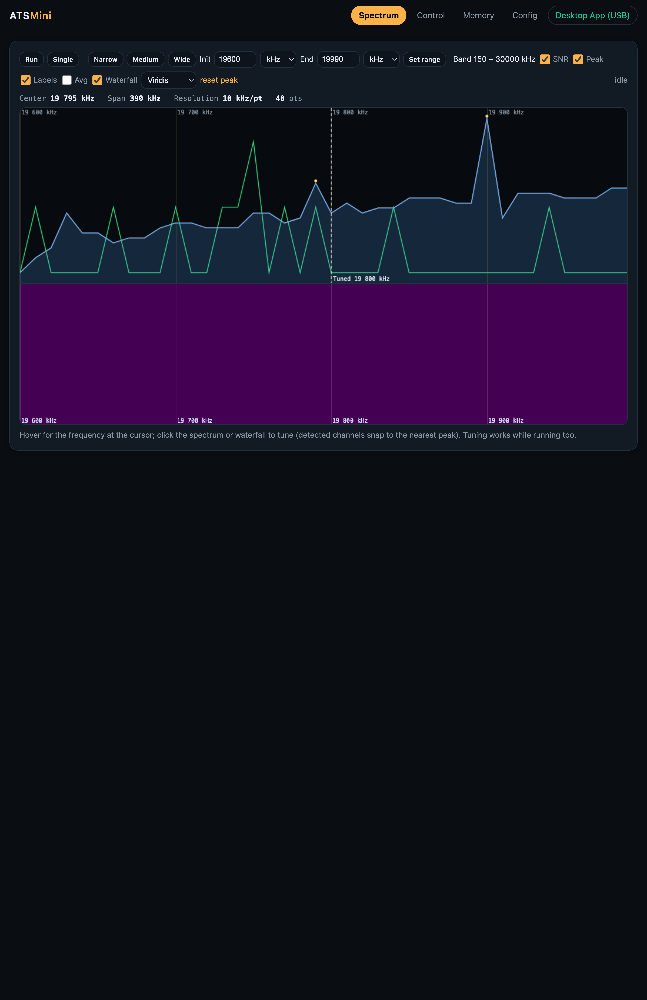
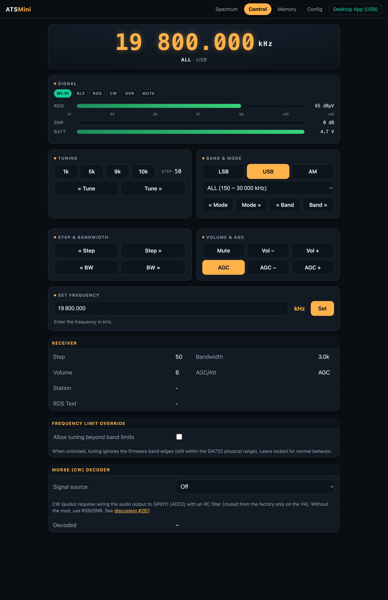
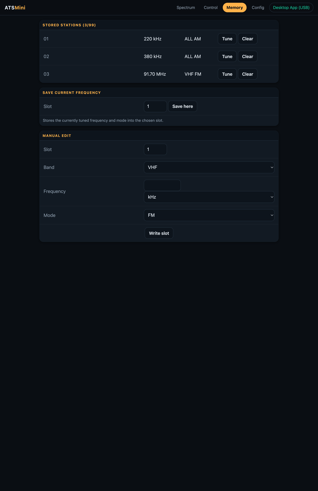
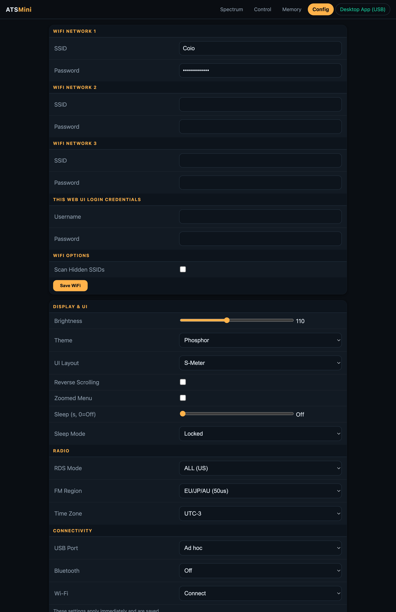
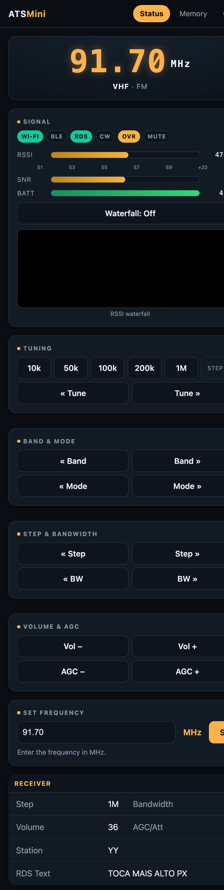
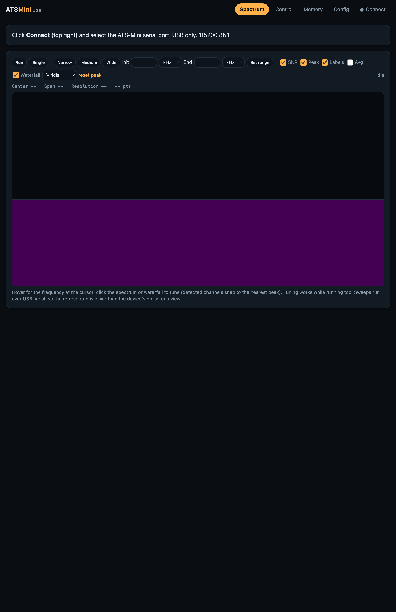

# ATS Mini


This firmware is for use on the SI4732 (ESP32-S3) Mini/Pocket Receiver

Based on the following sources:

* Volos Projects:    https://github.com/VolosR/TEmbedFMRadio
* PU2CLR, Ricardo:   https://github.com/pu2clr/SI4735
* Ralph Xavier:      https://github.com/ralphxavier/SI4735
* Goshante:          https://github.com/goshante/ats20_ats_ex
* G8PTN, Dave:       https://github.com/G8PTN/ATS_MINI

## Releases

Check out the [Releases](https://github.com/esp32-si4732/ats-mini/releases) page.

## Documentation

The hardware, software and flashing documentation is available at <https://esp32-si4732.github.io/ats-mini/>

## Discuss

* [GitHub Discussions](https://github.com/esp32-si4732/ats-mini/discussions) - the best place for feature requests, observations, sharing, etc.
* [TalkRadio Telegram Chat](https://t.me/talkradio/174172) - informal space to chat in Russian and English.

---

# Fork Features / Novidades deste Fork

This fork turns the radio into a remote-controllable SDR-style receiver. It adds
a **tabbed web app** (Spectrum / Control / Memory / Config) served by the device,
an **SDR spectrum + waterfall** with click-to-tune, an **RDS** display, an
**offline, installable Web Serial PWA** that drives the radio over USB with the
same interface, an on-device **RSSI waterfall**, an always-available **Morse (CW)
decoder**, a **frequency-limit override**, and documented serial and HTTP APIs
(including an extended line-based serial protocol). The sections below are
bilingual: English first, **Português** second.

*Este fork transforma o rádio em um receptor estilo SDR controlável remotamente.
Ele adiciona um **app web em abas** (Spectrum / Control / Memory / Config)
servido pelo dispositivo, um **espectro + cascata (waterfall) SDR** com
clique-para-sintonizar, exibição de **RDS**, um **PWA Web Serial offline e
instalável** que controla o rádio via USB com a mesma interface, uma **cascata de
RSSI** no próprio aparelho, um **decodificador de Morse (CW)** sempre disponível,
a **liberação dos limites de frequência** e APIs serial e HTTP documentadas
(incluindo um protocolo serial estendido baseado em linhas). As seções abaixo são
bilíngues: inglês primeiro, **Português** em seguida.*

## Web Control UI / Interface Web de Controle

A modern, responsive, dark "receiver console" served directly by the device.
Connect to the radio's Wi-Fi (AP mode) or join it to your network, then open
**http://atsmini.local/** (mDNS) or the device IP. It is a single-page app with
client-side **tabs — Spectrum, Control, Memory and Config** — plus a
**Desktop App (USB)** link in the header that opens the offline PWA (see below).
The legacy `/memory` and `/config` routes still work and deep-link to the
matching tab.

### Spectrum tab / Aba Spectrum

An SDR-style band scope that auto-runs on load.

* **Line spectrum** with current-level (blue, filled), peak-hold (orange),
  per-point **SNR** (green) and an optional running **average** trace, all on a
  shared frequency axis with gridlines, a ruler and adaptive units (kHz/MHz).
* A **Viridis / Inferno / Grayscale** **waterfall** heatmap aligned to the same
  axis, scrolling under the spectrum.
* **Init / End** frequency window inputs with **per-field kHz/MHz** unit
  selectors, validation feedback and a band-range hint; `Set range` applies it.
* A dashed **Tuned** marker, a hover **crosshair** showing the frequency under
  the cursor, and **click-to-tune** that snaps to the nearest detected signal
  peak (adaptive noise-floor peak detection).
* **Run / Single** sweep control and resolution presets (Narrow / Medium / Wide).
* A **device lock**: while a continuous sweep runs, the radio is paused and held
  muted (the device screen shows *"Waterfall (Web UI) — radio paused"*), and the
  other tabs reflect that the radio is busy.



### Control tab / Aba Control

The classic receiver console.

* High-contrast LED-style **frequency readout**, with the live **RDS** station
  name and radiotext shown underneath it.
* Animated **S-meter / SNR / battery** meters and status **badges**
  (Wi-Fi, BLE, RDS, CW, Override, Mute).
* Grouped panels: **Tuning** (dynamic step quick-select reflecting the steps the
  current band/mode actually supports), **Band & Mode** (mode selector plus a
  band selector listing every band with its frequency range), **Step &
  Bandwidth**, **Volume & AGC** (with an AGC On/Off toggle and a Mute toggle).
* A live, masked **Set Frequency** field that mirrors the current frequency in
  the active unit (spaces/commas are stripped on submit so tuning still works).
* A **Frequency Limit Override** toggle and the **Morse (CW)** decoded text and
  source selector.



### Memory tab / Aba Memory

A live, editable **station memory** list: tune any slot, save the current
frequency, clear a slot, or manually write a slot (band / frequency / mode).



### Config tab / Aba Config

Every on-device setting as a live, immediately-persisted control: Wi-Fi networks
and web-UI login, brightness, theme, UI layout, scrolling, sleep, RDS mode, FM
region, time zone, and USB / Bluetooth / Wi-Fi connectivity.



Radio commands from the browser are queued and executed in the main loop to
avoid racing with the receiver (I2C) hardware. The layout is fully responsive and
works well on a phone:



*Um "console de receptor" escuro, moderno e responsivo, servido diretamente pelo
rádio. Conecte-se ao Wi-Fi do rádio (modo AP) ou coloque-o na sua rede e abra
**http://atsmini.local/** (mDNS) ou o IP do dispositivo. É um aplicativo de
página única com **abas — Spectrum, Control, Memory e Config** — e um link
**Desktop App (USB)** no cabeçalho que abre o PWA offline (veja abaixo). As rotas
antigas `/memory` e `/config` continuam funcionando e abrem a aba correspondente.
A aba **Spectrum** é um analisador estilo SDR que roda sozinho ao carregar:
espectro em linha (nível atual, retenção de pico, SNR e média opcional), cascata
**Viridis / Inferno / Grayscale** alinhada ao mesmo eixo de frequência, campos
**Init / End** com seletor de unidade kHz/MHz por campo e validação, marcador
**Tuned** tracejado, mira ao passar o mouse e **clique-para-sintonizar** que
encaixa no pico detectado mais próximo; controle **Run / Single**; e um
**bloqueio do dispositivo** — durante a varredura contínua o rádio fica pausado e
mudo (a tela mostra "Waterfall (Web UI) — radio paused"). A aba **Control** traz
a leitura de frequência com **RDS** (nome da estação e radiotexto) abaixo,
medidores de **S-meter / SNR / bateria** e selos de estado, painéis de
**Sintonia, Banda e Modo, Passo e Largura de banda, Volume e AGC** (com botões de
AGC On/Off e Mudo), seletor de banda listando todas as bandas com suas faixas, um
campo **Definir Frequência** mascarado, o botão de liberação de limites e o texto
decodificado de **Morse (CW)**. A aba **Memory** é uma lista de **memórias**
editável ao vivo (sintonizar, salvar, limpar, escrever manualmente) e a aba
**Config** espelha todas as configurações do dispositivo, aplicadas e salvas na
hora. Os comandos do navegador são enfileirados e executados no laço principal
para não conflitar com o hardware do receptor.*

## Offline Web Serial PWA / PWA Web Serial Offline

An offline-capable, installable **Progressive Web App** (in `pwa/`) that controls
the radio over **USB** using the **Web Serial API**, with **full feature parity**
to the device web UI (the same Spectrum / Control / Memory / Config tabs). It
needs no Wi-Fi: it talks to the firmware through an extended line-based serial
protocol. Because Web Serial is Chromium-only, use **Google Chrome, Edge or
another Chromium browser** (it will not connect in Firefox/Safari).

It is hosted via **GitHub Pages** at
<https://wsalmi.github.io/ats-mini-salmer/pwa/> (open it once online to install;
it then runs offline). You can also open it from the **Desktop App (USB)** link
in the device web header. Click **Connect** and pick the ATS-Mini serial port
(USB only, 115200 8N1).

> To publish your own fork's PWA, enable Pages under **Settings → Pages → Build
> and deployment → Source: GitHub Actions**.



*Um **Progressive Web App** instalável e offline (em `pwa/`) que controla o rádio
via **USB** usando a **Web Serial API**, com **paridade total** com a interface
web do dispositivo (as mesmas abas Spectrum / Control / Memory / Config). Não
precisa de Wi-Fi: conversa com o firmware por um protocolo serial estendido
baseado em linhas. Como a Web Serial é exclusiva de navegadores Chromium, use
**Google Chrome, Edge ou outro navegador Chromium** (não conecta no
Firefox/Safari). É hospedado via **GitHub Pages** em
<https://wsalmi.github.io/ats-mini-salmer/pwa/> (abra online uma vez para
instalar; depois funciona offline) ou pelo link **Desktop App (USB)** no
cabeçalho. Clique em **Connect** e escolha a porta serial do ATS-Mini (USB,
115200 8N1). Para publicar o PWA do seu próprio fork, ative o Pages em
**Settings → Pages → Source: GitHub Actions**.*

## RSSI Waterfall / Cascata de RSSI

A continuous scrolling heatmap of band activity.

* **On-device:** open **Menu > Waterfall**. Rotating the encoder moves the scan
  center frequency; a button press exits and restores the previous frequency
  and mute state.
* **Web:** the waterfall now lives in the **Spectrum tab**, aligned to the line
  spectrum on a shared frequency axis (see above). It polls `/api/scan` until
  each scan completes (the `busy` field) before drawing the next row.
* **Mutual exclusion:** while a continuous sweep is active (on the device, or via
  the web Spectrum tab) it owns the radio, so normal tuning/listening is paused.
  The device shows *"Waterfall (Web UI) — radio paused"* and the web UI reflects
  the locked state.

*Um mapa de calor rolante e contínuo da atividade da banda. **No dispositivo:**
abra **Menu > Waterfall**; girar o encoder move a frequência central da varredura
e um clique sai, restaurando a frequência e o estado de mudo anteriores. **Na
web:** a cascata agora fica na **aba Spectrum**, alinhada ao espectro em linha no
mesmo eixo de frequência (veja acima), consultando `/api/scan` até cada varredura
terminar. **Exclusão mútua:** enquanto a varredura contínua está ativa (no
aparelho ou pela aba Spectrum) ela assume o rádio, então a sintonia/escuta normal
fica pausada; o dispositivo mostra "Waterfall (Web UI) — radio paused" e a UI web
reflete o estado bloqueado.*

## Morse (CW) Decoder / Decodificador de Morse (CW)

A live Morse decoder with a **pluggable signal source**. It defaults to the
**RSSI/SNR** envelope, which works on stock hardware with no modification. An
**audio (CW)** source samples the demodulated audio on GPIO11 (ADC2) and is meant
for an optional hardware mod (wire the audio output to IO11 through an RC low-pass
filter; routed from the factory only on the V4). The audio (CW) source is always
compiled in and selectable on screen — the menu warns that it needs the mod.
Without the mod, IO11 is unconnected and selecting CW just reads a floating pin
(use it at your own risk).

Select the source on the device via **Menu > Morse** (Off / RSSI / audio) or from
the web Status page. The decoded text is shown on the device screen and in the
web status (`morseText` in `/api/status`). See
[discussion #267](https://github.com/esp32-si4732/ats-mini/discussions/267).

*Um decodificador de Morse ao vivo com uma **fonte de sinal plugável**. Por
padrão usa o envelope **RSSI/SNR**, que funciona no hardware de fábrica sem
modificação. A fonte **áudio (CW)** amostra o áudio demodulado no GPIO11 (ADC2) e
é destinada a uma modificação de hardware opcional. A fonte de áudio (CW) está
sempre compilada e disponível na tela — o menu avisa que precisa da modificação.
Sem ela, o IO11 fica desconectado e selecionar CW apenas lê um pino flutuante
(use por sua conta e risco). Selecione a fonte em **Menu > Morse** ou pela página
web Status; o texto decodificado aparece na tela e no status web.*

## Frequency Limit Override / Liberação dos Limites de Frequência

Allows tuning beyond the firmware band edges (still within the SI4732 physical
range). It is **locked by default** for normal behavior. Toggle it via
**Settings > Freq Limit** on the device, the checkbox on the web Status page, or
the `P` serial command. When unlocked, the device shows *"Unlocked"* and the web
UI lights the **OVR** badge.

*Permite sintonizar além dos limites de banda do firmware (ainda dentro do
alcance físico do SI4732). Fica **bloqueado por padrão**. Alterne em
**Settings > Freq Limit** no dispositivo, pela caixa de seleção na página web
Status, ou pelo comando serial `P`. Quando liberado, o dispositivo mostra
"Unlocked" e a UI web acende o selo **OVR**.*

## Examples / Exemplos

### Serial / USB remote commands / Comandos remotos Serial / USB

The radio exposes a single-character control protocol over USB serial (enable
**USB Port = Ad hoc** in Config). Lowercase = down/counter-clockwise, uppercase =
up/clockwise. Verified commands (see `ats-mini/Remote.cpp`):

| Key | Action |
| --- | --- |
| `R` / `r` | Encoder clockwise / counter-clockwise (tune) |
| `e` / `E` | Encoder click / short press |
| `B` / `b` | Band up / down |
| `M` / `m` | Mode up / down |
| `S` / `s` | Step up / down |
| `W` / `w` | Bandwidth up / down |
| `A` / `a` | AGC/attenuation up / down |
| `V` / `v` | Volume up / down |
| `L` / `l` | Backlight up / down |
| `O` / `o` | Sleep on / off |
| `P` | Toggle frequency-limit override (lock/unlock) |
| `F<hz>\r` | Set frequency in Hz (honors override), e.g. `F91700000\r` |
| `$` | List stored memories |
| `#<slot>,<band>,<hz>,<mode>\r` | Write a memory slot (freq `0` clears it) |
| `C` | Capture screen as a hex BMP |
| `t` | Toggle periodic status logging |
| `I` / `i` | Calibration up / down |
| `T` / `^` / `@` | Theme editor: toggle / set / get colors |

On top of the single-character keys, the firmware also speaks an **extended,
line-based query protocol** (used by the Web Serial PWA) that mirrors the HTTP
API over USB, so a serial client reaches full parity without Wi-Fi. Commands are
terminated with `\r` and answered with `=`-prefixed lines (JSON reuses the same
builders as the web endpoints):

| Command | Response | Purpose |
| --- | --- | --- |
| `?STATUS` | `=STATUS {json}` | Full status (same JSON as `/api/status`) |
| `?MEM` | `=MEM {json}` | Memory slots (same JSON as `/api/memory`) |
| `?SCAN` | `=SCAN {json}` | Latest scan data (same JSON as `/api/scan`) |
| `?SCANRUN lo hi cont` | `=OK SCANRUN` | Run a scan over `[lo,hi]` Hz (`0 0` = centered); `cont=1` keeps sweeping and takes the device lock |
| `?SCANSTOP` | `=OK SCANSTOP` | Stop a continuous scan / release the lock |
| `?SET key val` | `=OK SET` | Change a setting (same keys as `/api/set`) |
| `?MEM action slot [band hz mode]` | `=OK MEM` | `tune` / `save` / `clear` / `set` a memory slot |

*Além das teclas de um caractere, o firmware também fala um **protocolo estendido
baseado em linhas** (usado pelo PWA Web Serial) que espelha a API HTTP via USB,
dando paridade total sem Wi-Fi. Os comandos terminam em `\r` e são respondidos
com linhas iniciadas por `=` (o JSON reutiliza os mesmos geradores dos endpoints
web): `?STATUS`, `?MEM`, `?SCAN`, `?SCANRUN lo hi cont`, `?SCANSTOP`,
`?SET key val` e `?MEM action slot ...`.*

### Web API examples (curl) / Exemplos de API Web (curl)

All endpoints live in `ats-mini/Network.cpp`. Examples against the live device:

```bash
# Live status (polled by the Status page)
curl http://atsmini.local/api/status

# Nudge a setting / pick a tuning step in kHz
curl 'http://atsmini.local/api/set?step=100'

# Set a direct frequency in Hz (honors the override lock)
curl 'http://atsmini.local/api/freq?hz=91700000'

# Send a raw single-char protocol command (here: tune clockwise)
curl 'http://atsmini.local/api/cmd?c=R'

# Trigger an RSSI scan, then fetch the latest waterfall data
curl 'http://atsmini.local/api/scan?run=1'
curl http://atsmini.local/api/scan

# List memory slots, then save the current frequency into slot 5
curl http://atsmini.local/api/memory
curl 'http://atsmini.local/api/mem?action=save&slot=5'
```

A trimmed real `GET /api/status` response from the device:

```json
{"ver":"F/W: v2.35 Jun 12 2026","band":"VHF","mode":"FM","freq":"91.70",
 "unit":"MHz","freqHz":91700000,"step":"1M","steps":[10,50,100,200,1000],
 "bw":"Auto","agc":0,"vol":36,"muted":false,"rssi":46,"snr":13,"batt":4.67,
 "ip":"192.168.68.101","station":"  WI    ","rt":"TOCA MAIS ALTO ... PX",
 "morse":0,"morseAudio":false,"morseText":"","override":true}
```

`/api/set` also accepts `morse`, `override`, `brt`, `rds`, `region`, `theme`,
`ui`, `zoom`, `scroll`, `sleep`, `sleepmode`, `utc`, `usb`, `ble` and `wifi`.
`/api/mem` supports `action=save|clear|tune|set` (with `band`, `hz`, `mode` for
`set`).

*Todos os endpoints estão em `ats-mini/Network.cpp`. Os exemplos acima funcionam
contra o dispositivo ao vivo: `/api/status` (status ao vivo), `/api/set?step=`
(ajustes/passo), `/api/freq?hz=` (frequência direta, respeita a trava),
`/api/cmd?c=` (comando bruto de um caractere), `/api/scan?run=1` (cascata) e
`/api/memory` + `/api/mem?action=save|clear|tune|set` (memórias).*

### Build / flash / Compilar / gravar

Using the included `ats-mini/Makefile` (profile `esp32s3-ospi`,
[arduino-cli](https://arduino.github.io/arduino-cli/)):

```bash
cd ats-mini

# Compile the firmware
make build

# Compile and flash over USB (adjust the serial port)
make upload PORT=/dev/cu.usbmodem1101
```

*Usando o `ats-mini/Makefile` incluso (perfil `esp32s3-ospi`): `make build` para
compilar e `make upload PORT=/dev/cu.usbmodem1101` para compilar e gravar via USB
(ajuste a porta serial).*
